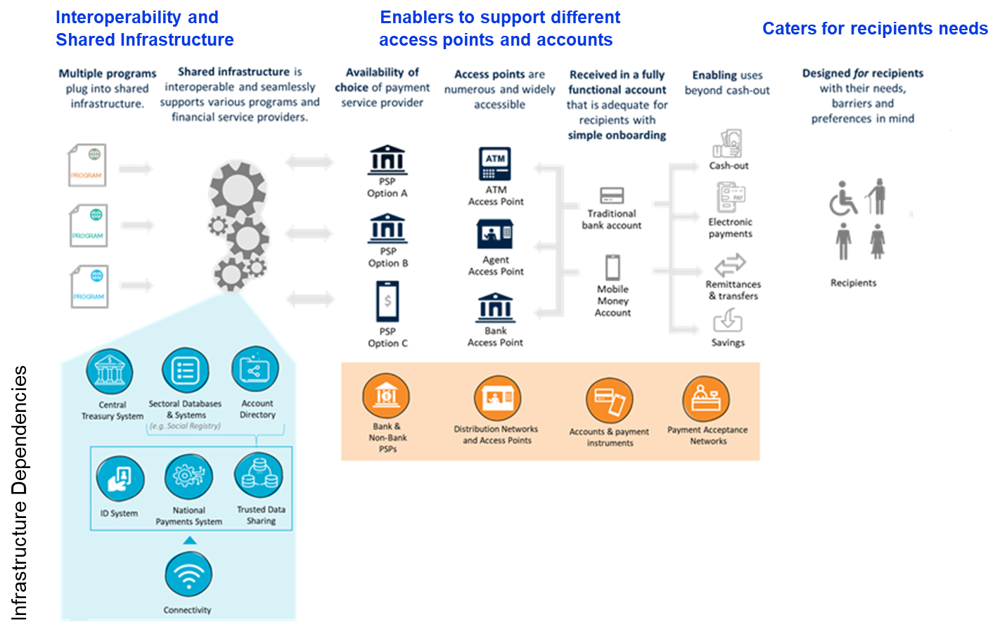
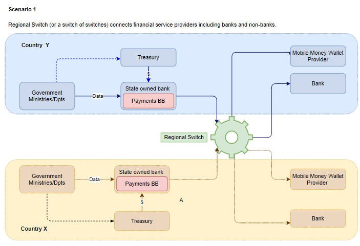
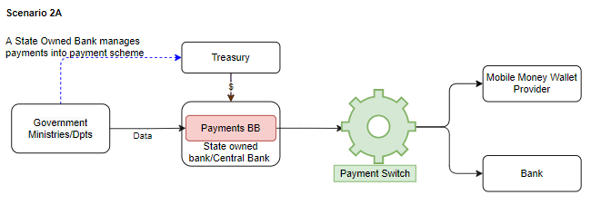
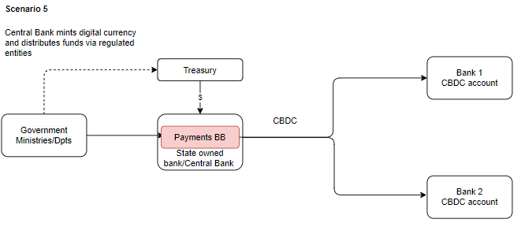

# 2 Description

The Payments Building Block enables digital financial payments to be tracked, evaluated, initiated, validated, processed, logged, compared and verified against budget. This Building Block also provides interoperability with connections to the various external applications that need payment services in order to trigger transitions in their own WorkFlow. Payment services generally interface through gateways to regulated financial entities such as banks, credit facilities, and insurance companies. To help users easily complete payment transactions and learn if their transaction succeeded or failed, it converts heterogeneous interface protocols, formats, and user interfaces to a standard set of common interfaces and formats. It can also help in tracking the costs of commodity and equipment purchases to optimize budgets.

The Payments Building Block consists of components that enable multiple use cases in a generic manner. The use cases include Government to Person (G2P), Person to Government (P2G), Government to Business (G2B), and Business to Government (B2G). The existing commercial Payments schemes are heterogenous across regions and countries, the Payments Building Block assumes that some components are optional when considering implementation. The Payments Building Block covers components that can be used to deliver the key functionalities and the connections to existing systems in the market, but does not contemplate building a new payments scheme

## 2.1 Financial Inclusion, Banks, and Mobile Money Accounts 

Financial inclusion strategies have largely been based on growing access to regulated accounts. These were traditionally understood to be bank accounts, in recent years Mobile Money (MoMo) accounts have greatly increased transactional account access. These MoMo accounts are often, but not always, treated as secondary to the banking system and lack interoperability.

That said, today, with over 1.2 billion global accounts, transacting an average of over $2 billion per day, mobile money has grown to become the leading payment platform in a growing number of emerging markets. Today, there are more mobile money accounts in Sub-Saharan Africa than there are bank accounts. Indeed, during the pandemic, demand for mobile money services increased among businesses, governments, and new services that previously relied on cash or other payment channels.

There are currently active discussions in many markets that need the integration of mobile money into existing national infrastructure. While the integration of mobile money into existing schemes and infrastructure has the potential to create value for all stakeholders in the ecosystem, many legacy payment systems may not be suitable for mobile money integration in their current state. As an example, many existing interbank switches do not support mobile money as a core feature because of legacy technical architecture. What is often missing is the essential capability of the switch to handle high-volume, low-value flows with the mobile number (Mobile Station Integrated Services Digital Network) as identifier for routing and address resolution hence the need for integration.

Recent industry developments offer solutions designed to solve many of the issues around the switching of mobile money.

Mobile money providers, regulators, infrastructure providers, and other financial system players should seek to engage in any potential interoperability initiatives from an early stage to ensure optimal payment system design for all parties. Should existing infrastructure be used, a thorough assessment should be conducted, with input from all parties, to ensure appropriate governance, commercial, and technical standards are incorporated.

Mandating interoperability within a short time frame removes opportunities for a thoughtful and holistic analysis of commercial sustainability. Requiring immediate interoperability can also delay or hamper the uptake of interoperable transactions, and mobile money services altogether. This is a particular risk in contexts where regulators or governments impose immediate connections to a centralized hub. Mobile money providers should be encouraged to connect when their service is ready. However alternative modalities of payment such as cash vouchers can also be considered in scenarios of low-resource regions that lack modern infrastructure and a volume of mobile phone users.

Also, in countries where mobile money providers are not connected to a payment switch, aggregators can enable the flow of funds between multiple financial service providers including banks and non-banks. While aggregators may not be as efficient and scalable as switches, they can help solve interoperability issues in the short and medium term.

## 2.2 Payments Building Block Capabilities 

Generally, the Building Block is supportive of multiple types of payment use cases where the Government is one of the parties:

* **Government to people (G2P)**
  * Payment where the payer is a government and the payee is an individual e.g. Social benefits disbursement, government salary payments, Conditional and [Unconditional Social Cash Transfers](https://solutions.dial.community/use\_cases/unconditional\_social\_cash\_transf/use\_case\_steps/outreach\_communications)).
* **People to Government (P2G).**
  * Payment where the payer is an individual and the payee is a government. P2G payments can be government initiated, for instance, in the case of payments for registrations for government services. For bill payments and payments for government services directly by the person, the system should provide the person with the flexibility to choose which payment instrument to use (eg. mobile money, bank transfer or card payments). (e.g. payment of taxes, payment[ Registration for Postpartum and Infant Care](https://github.com/GovStackWorkingGroup/BuildingBlockAPI/issues/1), payment of school fees, driving license, utility payments).
* **Government to Business (G2B)**
  * G2B payments include tax refunds, goods and services purchases, subsidies, contract payments, benefits, and loans.
* **Business to Government (B2G)**
  * B2G payments include paying taxes and fees.
* **Government to Government (G2G)**
  * Payments between two government entities (i.e. between Ministries/Departments and public sector institutions).

Government to Business payments (G2B) and Government to Government (G2G) are not covered in this specification and will be covered in the second phase.

## 2.3 Mapping Based on Level of Maturity 

The [DIAL use cases](https://drive.google.com/drive/folders/1JYdcmeUhJrwl7TfSuVtBJ9a0C335VbRg) can be mapped to the payments building block capabilities as follows.

| **Capabilities** | **Payment Infrastructure Scenario** | **DIAL User journey**                                                                                                                                                                                                                                                                                                                                                  | **Use Cases**                                                                                                                                              | Destination Channel                                 |
| ---------------- | ----------------------------------- | ---------------------------------------------------------------------------------------------------------------------------------------------------------------------------------------------------------------------------------------------------------------------------------------------------------------------------------------------------------------------- | ---------------------------------------------------------------------------------------------------------------------------------------------------------- | --------------------------------------------------- |
| G2P              | Scenario 1-4 & 6                    | 
Payment - Unconditional Social Cash Transfer (direct payment based on family relationship)

 

<a href="https://solutions.dial.community/use_cases/unconditional_social_cash_transf">Payment - Unconditional Social Cash Transfer (bank payments)</a>

 

Payment - Unconditional Social Cash Transfer (non-electronic/cash payments)
 | 
a). Beneficiary payment, Incentive payment to mother.

 

b) Government Salary payment

 

c) Unconditional cash transfer
 | Voucher payment, Mobile Money, direct bank transfer |
| P2G              | Scenario 1-4 & 6                    | [Postpartum care](https://solutions.dial.community/use\_cases/postpartum\_and\_infant\_care)                                                                                                                                                                                                                                                                           | Payment - registration of birth (Postpartum and Infant Care)                                                                                               | Mobile Money.                                       |

### 2.4 Infrastructure Requirements 

| Modality     | Infrastructure Components                                                                                                                                                                                   | Comments                                                                                                                                                                                                                                                                                                                                                                                                                                                                                                                                                                                                                                                                                                                                                                         |
| ------------ | ----------------------------------------------------------------------------------------------------------------------------------------------------------------------------------------------------------- | -------------------------------------------------------------------------------------------------------------------------------------------------------------------------------------------------------------------------------------------------------------------------------------------------------------------------------------------------------------------------------------------------------------------------------------------------------------------------------------------------------------------------------------------------------------------------------------------------------------------------------------------------------------------------------------------------------------------------------------------------------------------------------- |
| Mobile Money | <ul><li>Account lookup - directory service</li><li>Payment portal</li><li>Payment gateway (only in selected scenarios)</li><li>Payment request initiation</li><li>Notification service</li></ul>
 
 | 
Mobile money is a destination account to distribute funds to end users (in the case of G2P) or an initiation account to enable users to initiate a payment for government services (P2G) which is facilitated by private commercial entities,  typically Mobile Network Operators.

 

There are three ways that facilitate interoperability between a mobile money provider and a financial service institution (which could be the initiator of a payment - G2P or the receive - P2G): Through a Switch, through a third-party aggregator or through a bilateral integration. We expect one or multiple of these components to be in place to facilitate the use cases discussed in this document but these will remain out of the payment building block.
 |
| Vouchers     | Voucher Management System, Merchant Ecosystem, Merchant Registry                                                                                                                                            | The Merchant Ecosystem and the Merchant Registry are both outside the scope of the Payments Building Block. The development of the Merchant Ecosystem will be driven by the relevant government institution. The Merchant Registry will be managed by another building block.                                                                                                                                                                                                                                                                                                                                                                                                                                                                                                    |

## 2.5 Payment Infrastructure Deployment Scenarios

## &#x20;2.5. 1 Regional Switch vs Country Switch 

Domestic payment switches have specific economic characteristics and may not reach adequate economies of scale. Whilst costs can be passed onto customers, without sufficiently low charges, volumes may remain perennially low. Domestic switches facing this scenario thus remain under-utilized, costly, and under-capitalized. In recent years, the concept of Regional payment switches has gained some traction with new efforts realized or underway across the Southern African Development Community (SADC), West African Monetary and Economic Union (UEMOA), East African Community (EAC), and Economic and Monetary Community of Central Africa (CEMAC).

Regional switches (which may serve as a common resource for multiple countries) often rely on pre-existing arrangements between Central Banks, regional Commercial Banks, or a combination thereof. When multiple currencies are in play, a reference currency or a basket of currencies must be chosen for regional settlement accounts to be viable. Settlement arrangements are vital to the viability of a regional switch. A Regional switch may also integrate financial transactions from countries that already have domestic payment switches (like a switch of switches).

Regional switches may take on any and all use cases or may be restricted to specific use cases, for example, Large Value Transfer or B2B trade. Because regional trade drives economic activity, regional switches often go hand in hand with the portability of business and consumer credentials (i.e. relating to Customer Due Diligence), trade policy, and movement of labor.

## 2.5.2 Payment infrastructure scenarios

The Payments Building Block sits between the government account systems (i.e. at the Ministry of FInance or Central Bank) and the public or private switching available in the market. As such the Payments Building Block is assumed in each, but not shown. The primary focus in describing these scenarios is on the relationship between payment schemes, banking institutions, and government institutions. This section describes what is available in-country.

| **Infrastructure Scenarios**                                                                                                                                                                                       | **Suggested Approach**                                                                                                                                                                                                                                                                                                                                                                                                                                                                                |
| ------------------------------------------------------------------------------------------------------------------------------------------------------------------------------------------------------------------ | ----------------------------------------------------------------------------------------------------------------------------------------------------------------------------------------------------------------------------------------------------------------------------------------------------------------------------------------------------------------------------------------------------------------------------------------------------------------------------------------------------- |
| 
<strong>Payment Infrastructure Scenario 1</strong> Regional Switch (or a switch of switches) connects financial service providers including banks and non-banks in different countries in a region.
      | Government should leverage the regional payments switch (scheme) to enable all use-cases. This may also imply important developments of a standardized Customer Due Diligence (CDD). Note that while a State owned bank is shown in the diagram below, the option exists for the Government to designate a specific Commercial bank, or to have the funds flow directly from the Ministry of Finance (Treasury) assuming such Treasury payment functionality can be supported by the Regional Switch. |
| 
<strong>Payment Infrastructure Scenario 2</strong> A payment switch connecting financial service providers such as banks to non-banks including mobile money providers is in place and actively working.
 | Government should leverage the existing switch to enable payments use-cases to reach mobile money providers. There may be a State Owned Bank (2-A) or not (2-B).                                                                                                                                                                                                                                                                                                                                      |
| 
<strong>Payment Infrastructure Scenario 3</strong> A payment switch is in place in the country or is in the process to be deployed but non-banks, including mobile providers are not connected to it.
    | 
Government should leverage third-party aggregators or bilateral integrations to enable payment use-cases to reach mobile money providers.

 
                                                                                                                                                                                                                                                                                                                                           |
| 
<strong>Payment Infrastructure Scenario 4</strong> A payment switch is not place or in the process of being deployed
                                                                                     | Government should leverage third-party aggregators or bilateral connections to enable payment use-cases to reach mobile money providers                                                                                                                                                                                                                                                                                                                                                               |
| 
<strong>Payment Infrastructure Scenario 5</strong> Government makes G2P payments using Central Bank Digital Currency (CBDC) .
                                                                            | The Central Bank distributes the funds for the CBDC accounts via regulated entities (e.g. Payment Service Providers).                                                                                                                                                                                                                                                                                                                                                                                 |
| 
<strong>Payment Infrastructure Scenario 6</strong> Citizens have CBDC accounts directly with the Central Bank or other accounts with other payment service providers
                                     | The Central Bank sets up limited accounts for each person, providing a base level of access and functionality. Such accounts may be denominated in country currency (fiat) or CBDCs. This scenario places more responsibility on government structures and is not often considered (outside of Postal Banks and the like).                                                                                                                                                                            |

Under each of these scenarios, there are different setups possible that relate the key roles played by the Programmatic Ministries (e.g. Ministry of Education or Pension Program), the Ministry of Finance, the Central Bank, and the existing Payment Switch.

The flow of funds and the flow of data are separate but equally important and they have a number of interactions.

### 2.5.2.1 Payment Infrastructure Scenario 1 

Regional Switch (or a switch of switches) connects financial service providers including banks and non-banks.

### 2.5.2.2 Payment Infrastructure Scenario 2-A 

Scenario 2-A and Scenario 2-B cover the concept of separating flows of data from accounting flows.

The Central Bank receives the funds transfer advice from the Treasury and the data from the Ministry of Health and does the steps of breaking it into bulk, based on rules of capacity of source and destination systems. Payments are then routed “on-us” or to the external financial providers “off-us” via a payment switch or similar mechanism.

### 2.5.2.3 Payment Infrastructure Scenario 2-B 

The Central Bank plays a key role as a participant in the Payment scheme and routes the payment details and funds via a shared service of the payment switch. The same logic of break-bulk applies and with all transactions effectively “off-us”.

### 2.5.2.4 Payment infrastructure scenario 3 

Government should leverage third-party aggregators to enable payment use cases to reach mobile money providers

### 2.5.2.5 Payment Infrastructure Scenario 4 

A payment switch is not in place or in the process of being deployed. Government should leverage third-party aggregators or bilateral connections to enable payment use cases to reach mobile money providers. In the bilateral connection scenario, each mobile money provider in the country would connect to the government portal through APIs, enabling a seamless transfer of funds to end users (in the case of G2P payments) or the receiving of funds from end users (in the case of P2G payments) and facilitate reporting, reconciliation and settlement processes.

 (1) (2).png>)

### 2.5.2.6 Payment Infrastructure Scenario 5 

The Central Bank mints digital currency and distributes funds via regulated entities (e.g. Payment Service Providers), and in the case of G2P sends funds to destination accounts known to the Ministry of Finance. Account information is unitary and unique for all beneficiaries (e.g. citizens) but the Central Bank does not “hold” account balances on an individual basis.

### 2.5.2.7 Payment Infrastructure Scenario 6 

The Central Bank directly provides Digital Accounts for all people (Citizens) and Treasury routes funds to the relevant accounts (uniquely and unitarily held by people).

* For this payment use case, the most common scenarios currently in place are 1 to 4, scenario 5 and 6 could be envisaged later.
* In Scenario 2B it is assumed that the Payment Switch is run by the Central Bank.
* In Scenario 2A and 3 it is assumed that the Payment Switch is an independent part outside the Central Bank.

## &#x20;2.6 Out of Scope Assumptions 

* Payment scheme creation is outside of the scope.
* Government to Business and Government to Government Payments are out of scope for the first phase and will be considered in the second phase.
* Identity systems are separate and outside the Payments Building Block, with key implications for KYC(Know Your Customer)/CDD(Customer Due Diligence) in the banking system.
* Consent of people eligible as beneficiaries of G2P programs for their personal details (i.e. National ID and payments details) to be stored in the tokenized form in the centralized mapper (where the government has to implement the mapper).
* Delegation of authority - Consent of the recipient for payment of G2P to be made to a third party (next of kin) is outside the scope of the Payments Building Block. It should be handled by the consent management building block at the time of beneficiary registration for the G2P program.
* For social benefits G2P payments, social registries are an essential Building Block that will implement the registration and determination of potential eligibility of citizens for one or more social programs. As such, they are a separate Building Block and are outside the Payments Building Block.
* An Integrated Financial Management Information System (IFMIS) and a Treasury Single Account (TSA) are essential components in improving the safety and efficiency of government payment programs. The TSA, in particular, ensures effective aggregate control over government cash balances and facilitates the reconciliation between banking and account data. It is assumed that these components exist at the level of the government as they are outside the scope of the Payments Building Block.
* Settlement systems are outside of the scope, Settlement allows the flow of money between participants and can be done on a Pre-funding basis which allows incoming transactions if the sending Digital Financial Service Provider (DFSP) has already deposited sufficient liquidity with them. Alternatively, settlement can be on a Clearing-base where FSPs allow incoming transactions before receiving the funds.
* Pricing. This generally revolves around processing fees (for each transaction a fixed fee is paid to the entity processing the transaction) and interchange (where one participant agrees to pay the other).
* Dispute resolution mechanisms allow FSPs to reach a consensus on a transaction’s status and financial liabilities in the case of a dispute. There are two main dispute resolution mechanisms: the consensus option where parties must agree on a transaction’s status; and the arbitration option where one party has authority over a transaction’s status.
* Governance defines sets of rules on how participants make decisions.
* Development of the voucher management ecosystem that is outside the technical specification of the Payments Building Block, including but not restricted to recruitment and registration of merchants/agents for the redemption of vouchers, etc.
