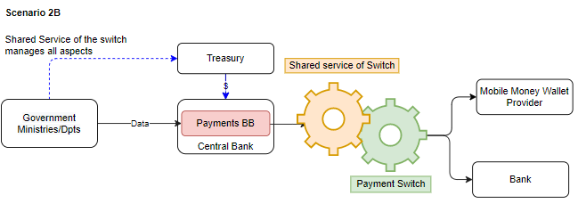
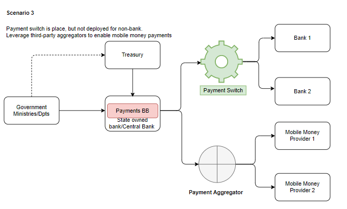

# 4 Payment Infrastructure Deployment Scenarios

## 4. 1 Regional Switch vs Country Switch 

Domestic payment switches have specific economic characteristics and may not reach adequate economies of scale. Whilst costs can be passed onto customers, without sufficiently low charges, volumes may remain perennially low. Domestic switches facing this scenario thus remain under-utilized, costly, and under-capitalized. In recent years, the concept of Regional payment switches has gained some traction with new efforts realized or underway across Southern African Development Community (SADC), West African Monetary and Economic Union (UEMOA), East African Community (EAC), and Economic and Monetary Community of Central Africa (CEMAC).

Regional switches (which may serve as a common resource for multiple countries) often rely on pre-existing arrangements between Central Banks, regional Commercial Banks, or a combination thereof. When multiple currencies are in play, a reference currency or a basket of currencies must be chosen for regional settlement accounts to be viable. Settlement arrangements are vital to the viability of a regional switch. A Regional switch may also integrate financial transactions from countries that already have domestic payment switches (like a switch of switches).

Regional switches may take on any and all use cases, or may be restricted to specific use cases, for example Large Value Transfer or B2B trade. Because regional trade drives economic activity, regional switches often go hand in hand with portability of business and consumer credentials (i.e. relating to Customer Due Diligence), trade policy, and movement of labor.

## 4.2 Payment infrastructure scenarios

The Payments building block (BB) sits between the government account systems (i.e. at the Ministry of FInance or Central Bank) and the public or private switching available in the market. As such the PaymentsBB is assumed in each, but not shown. The primary focus in describing these scenarios is on the relationship between payment schemes, banking institutions, and government institutions. This section describes what is available in-country.

| **Infrastructure Scenarios**                                                                                                                                                                                       | **Suggested Approach**                                                                                                                                                                                                                                                                                                                                                                                                                                                                                |
| ------------------------------------------------------------------------------------------------------------------------------------------------------------------------------------------------------------------ | ----------------------------------------------------------------------------------------------------------------------------------------------------------------------------------------------------------------------------------------------------------------------------------------------------------------------------------------------------------------------------------------------------------------------------------------------------------------------------------------------------- |
| 
<strong>Payment Infrastructure Scenario 1</strong> Regional Switch (or a switch of switches) connects financial service providers including banks and non-banks in different countries in a region.
      | Government should leverage the regional payments switch (scheme) to enable all use-cases. This may also imply important developments of a standardized Customer Due Diligence (CDD). Note that while a State owned bank is shown in the diagram below, the option exists for the Government to designate a specific Commercial bank, or to have the funds flow directly from the Ministry of Finance (Treasury) assuming such Treasury payment functionality can be supported by the Regional Switch. |
| 
<strong>Payment Infrastructure Scenario 2</strong> A payment switch connecting financial service providers such as banks to non-banks including mobile money providers is in place and actively working.
 | Government should leverage the existing switch to enable payments use-cases to reach mobile money providers. There may be a State Owned Bank (2-A) or not (2-B).                                                                                                                                                                                                                                                                                                                                      |
| 
<strong>Payment Infrastructure Scenario 3</strong> A payment switch is in place in the country or is in the process to be deployed but non-banks, including mobile providers are not connected to it.
    | 
Government should leverage third-party aggregators or bilateral integrations to enable payment use-cases to reach mobile money providers.

 
                                                                                                                                                                                                                                                                                                                                           |
| 
<strong>Payment Infrastructure Scenario 4</strong> A payment switch is not place or in the process of being deployed
                                                                                     | Government should leverage third-party aggregators or bilateral connections to enable payment use-cases to reach mobile money providers                                                                                                                                                                                                                                                                                                                                                               |
| 
<strong>Payment Infrastructure Scenario 5</strong> Government makes G2P payments using Central Bank Digital Currency (CBDC) .
                                                                            | The Central Bank distributes the funds for the CBDC accounts via regulated entities (e.g. Payment Service Providers).                                                                                                                                                                                                                                                                                                                                                                                 |
| 
<strong>Payment Infrastructure Scenario 6</strong> Citizens have CBDC accounts directly with the Central Bank or other accounts with other payment service providers
                                     | The Central Bank sets up limited accounts for each person, providing a base level of access and functionality. Such accounts may be denominated in country currency (fiat) or CBDCs. This scenario places more responsibility on government structures and is not often considered (outside of Postal Banks and the like).                                                                                                                                                                            |

Under each of these scenarios, there are different setups possible that relate the key roles played by the Programmatic Ministries (e.g. Ministry of Education or Pension Program), the Ministry of Finance, the Central Bank and the existing Payment Switch.

The flow of funds and the flow of data are separate but equally important and they have a number of interactions.

### 4.2.1 Payment Infrastructure Scenario 1 

Regional Switch (or a switch of switches) connects financial service providers including banks and non-banks.

### 4.2.2 Payment Infrastructure Scenario 2-A 

Scenario 2-A and Scenario 2-B cover the concept of separating flows of data from accounting flows.

The Central Bank receives the funds transfer advice from the Treasury and the data from the Ministry of Health and does the steps of breaking it into bulk, based on rules of capacity of source and destination systems. Payments are then routed “on-us” or to the external financial providers “off-us” via a payment switch or similar mechanism.

### 4.2.3 Payment Infrastructure Scenario 2-B 

The Central Bank plays a key role as a participant in the Payment scheme and routes the payment details and funds via a shared service of the payment switch. Same logic of break-bulk applies and with all transactions effectively “off-us”.

### 4.2.4 Payment infrastructure scenario 3 

Government should leverage third-party aggregators to enable payment use-cases to reach mobile money providers

### 4.2.5 Payment Infrastructure Scenario 4 

A payment switch is not in place or in the process of being deployed. Government should leverage third-party aggregators or bilateral connections to enable payment use-cases to reach mobile money providers. In the bilateral connection scenario, each mobile money provider in the country would connect to the government portal through APIs, enabling a seamless transfer of funds to end users (in the case of G2P payments) or the receiving of funds from end users (in the case of P2G payments) and facilitate reporting, reconciliation and settlement processes.

 (1) (2).png>)

#### 4.2.6 Payment Infrastructure Scenario 5 

The Central Bank mints digital currency and distributes funds via regulated entities (e.g. Payment Service Providers), and in the case of G2P sends funds to destination accounts known to the Ministry of Finance. Account information is unitary and unique for all beneficiaries (e.g. citizens) but the Central Bank does not “hold” account balances on an individual basis.

### 4.2.7 Payment Infrastructure Scenario 6 

The Central Bank directly provides Digital Accounts for all people (Citizens) and Treasury routes funds to the relevant accounts (uniquely and unitarily held by people).

* For this payment use case the most common scenarios currently in place are 1 to 4, scenario 5 and 6 could be envisaged later.
* In Scenario 2B it is assumed that the Payment Switch is run by the Central Bank.
* In Scenario 2A and 3 it is assumed that the Payment Switch is an independent part outside the Central Bank.

### 4.3 Prerequisites 

* The Payments Building Block assumes that all identification, registration, and enrollment logic by GovStack components are done externally before using this building block and those elements are presentable if required for compliance with regulated payments and banking systems within a jurisdiction.
* Further, the Payment System or Scheme in a country may require that participating payor or payee entities, whether health clinics, ministries, or individuals must have been registered with a regulated banking or non-banking entity - i.e. for accounts - as understood in that context prior to use of the payments BB.
* In the context of CBDC or Central Bank Accounts for individuals, the payment system block would assume that the regulatory conditions must have been verified for compliance and that payor and payee entities must have been properly registered according to the rules in that scheme.
* The Payments Building Block assumes the conditions of statutory and operational requirements around accounts (i.e. KYC/AML/CFT) must have been completed by an outside system, which are themselves capable of communicating that status in appropriate timeframes.
* The Payments Building Block assumes that capabilities of underlying infrastructure must enable transactions to meet a predefined limit to turn-around-time in real time response\
  (e.g. < 500ms response times) when called for in immediate or instant payment systems and for queuing systems when required for management of high throughput and/or asynchronous systems.
* During operation, the Payment Block should have the ability to validate against a set of external systems for status of account, account address and routing information, confirmation of payment, and various error conditions of accounts and specific payments.
* During operation in certain modes, the Payment Block would be validating against authorizations/releases or allotments provided by the treasury systems for source of funds, and designated third party providers would perform net debit cap management prior to processing the payments. These validations SHOULD be done within the system against the available allotments/funds.
* Normally, verification of eligibility of beneficiaries for the service should be done in another block. If eligibility for a standing instruction is part of the design within this BB, then the responsibility lies with the Enrollment or Payroll system to send such standing instructions and to cancel or revoke such standing instructions.
* Budget availability must be checked before voucher creation is requested. This could be done on a bulk or individual voucher basis. For efficiency, it would be recommended to create vouchers in bulk and then only activate/preactivate them as needed.
* Calculations of payments may depend on several attributes laid down by a specific program such as Unconditional Social Cash Transfer (USCT) or Postpartum Healthcare benefits. Based on these attributes and rules the statement of payments to be disbursed must be generated in respective applications and issued to the payments BB.
* It is understood that payment systems in the market, either provided by a public entity, a quasi public entity, or a purely commercial player, are required for the functioning of this building block. That is, systemically significant systems play an important role in both origination of payments and termination of payments as well as payment clearing and settlement. To be explicit, settlement (gross or net) must be handled externally to this BB. In the absence of appropriate payment rails, this building block would require additional features and functionality. Such systems MUST provide the following functionality to this use case:
  * Rules by which transactions are initiated, halted, reversed, examined.
  * Destination system for funds and related channels by which the Recipient accesses the funds.
  * Source system for funds and related channels for the individual or institution.
